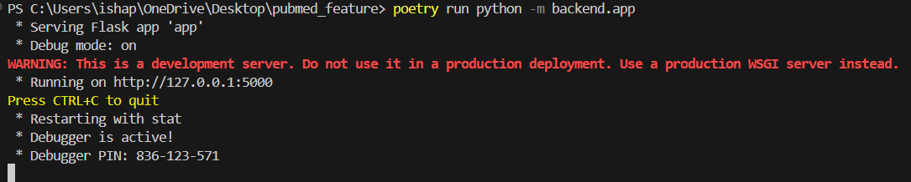
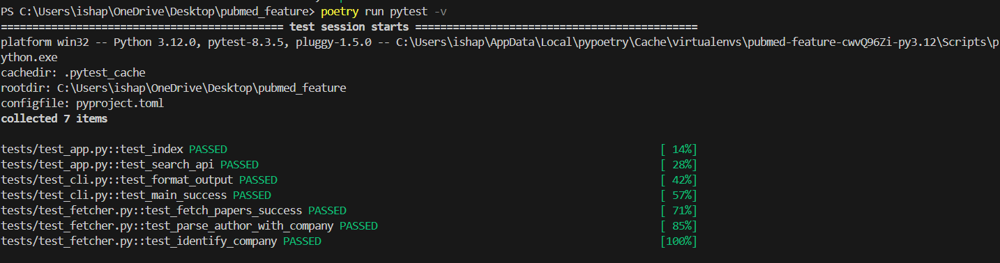

# PubMed Paper Fetcher

A Python tool to fetch research papers from PubMed with pharmaceutical/biotech company affiliations.

## Features

- Fetches papers from PubMed based on user queries
- Identifies papers with authors affiliated with pharmaceutical/biotech companies
- Provides both command-line interface (CLI) and web interface
- Outputs results in CSV format with:
  - PubmedID
  - Title
  - Publication Date
  - Non-academic Author(s)
  - Company Affiliation(s)
  - Corresponding Author Email

## Code Organization
pubmed_feature/
├── backend/ # Core functionality
│ ├── app.py # Flask web application
│ ├── fetcher.py # PubMed API interaction and data processing
│ └── init.py
├── cli/ # Command-line interface
│ └── cli.py # CLI implementation
├── frontend/ # Web interface
│ └── templates/
│ └── index.html # Web UI
├── tests/ # Unit tests
│ ├── test_app.py # Web app tests
│ ├── test_cli.py # CLI tests
│ ├── test_fetcher.py # Core functionality tests
│ └── init.py
├── poetry.lock # Dependency lock file
└── pyproject.toml # Project configuration


## Installation

1. Ensure you have Python 3.8+ installed
2. Install Poetry (dependency manager):
   ```bash
   pip install poetry

## Clone this repository:
git clone https://github.com/yourusername/pubmed_feature.git
cd pubmed_feature

## Install dependencies
poetry install

## USage 
## Command Line Interface

# Basic usage
poetry run get-papers-list "cancer treatment"

# Save to CSV file
poetry run get-papers-list "cancer treatment" -f output.csv

# Debug mode
poetry run get-papers-list "cancer treatment" -d

poetry run python -m backend.app

## Web Interface
Start the web server:


poetry run python -m backend.app
Open http://localhost:5000 in your browser

Enter your search query and view results

Export to CSV with the button provided

## Dependencies
Python 3.8+

Poetry (for dependency management)

## Libraries:

requests - HTTP requests

beautifulsoup4 - XML/HTML parsing

flask - Web interface

pytest - Testing framework

## Tools Used
PubMed API (https://www.ncbi.nlm.nih.gov/home/develop/api/)

BeautifulSoup (https://www.crummy.com/software/BeautifulSoup/)

Flask (https://flask.palletsprojects.com/)

Poetry (https://python-poetry.org/)

## Testing
Run tests with:

poetry run pytest

## CLI/Web tool fetching PubMed papers → CSV/table outputs (see screenshot)




